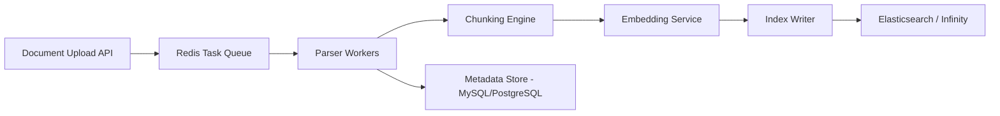
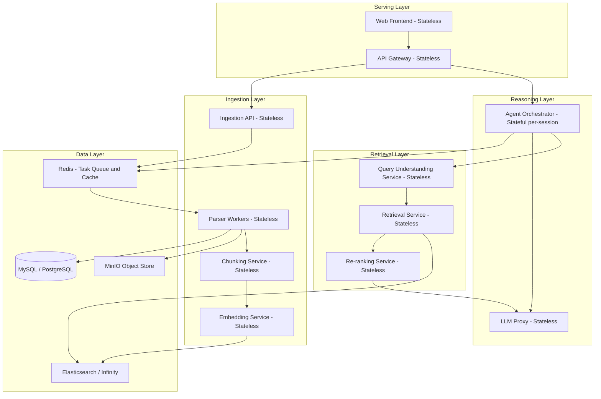

# Assignment 4: Architectural Analysis of RAGFlow
## 1. Deep Document Understanding vs Naive Chunking
Fixed-size chunking, such as splitting every 512 tokens with overlap, treats documents as flat streams of text, discarding the spatial and semantic structure that authors use to organize information. RAGFlow's DeepDoc engine instead performs layout-aware parsing, using OCR, layout recognition, which includes 10 component types: titles, headers, figures, tables, captions, etc., and Table Structure Recognition (TSR), to produce chunks that align with the logical units of a document.

### Retrieval Fidelity
Deep document understanding preserves semantic coherence within chunks. A financial table split mid-row by a fixed-size chunker yields two fragments, each meaningless in isolation; neither can answer a question such as 'what was Q3 revenue?' but a layout-aware parser recognizes the table boundary, applies TSR to extract rows and columns, and emits the entire table (or row group) as a single chunk with structured metadata. The same principle applies to section headings, figure-caption pairs, and multi-column layouts, deep parsing ensures the retrieval unit matches the author's informational unit, dramatically reducing false negatives (relevant content split across chunks) and false positives (noise from cross-boundary fragments).

### Index Design
Layout-aware chunks carry rich metadata (document section hierarchy, page number, bounding-box coordinates, element type). This enables faceted indexing: filters on 'element_type=table', section path queries, and metadata-boosted ranking. Fixed-size chunks offer only position-offset metadata, limiting the index to flat token-level retrieval. Deep understanding also produces variable-length chunks, requiring the index to handle heterogeneous chunk sizes, favoring engines like Elasticsearch that support both inverted and dense indexes over rigid fixed-dimension ANN indexes alone.

### Preprocessing Cost
The trade-off is computational: DeepDoc runs OCR models, layout classifiers (ONNX-based CNNs), TSR models, and XGBoost text-concatenation predictors per page. For a 100-page scanned PDF, this can take minutes on CPU versus seconds for regex-based fixed-size splitting. Additionally, DeepDoc evaluates 4 rotation angles per table for scanned documents. This cost is amortized at ingestion time and paid once per document, making it acceptable for enterprise workloads where retrieval quality dominates query-time latency budgets. However, for high-volume, low-stakes corpora (e.g., ephemeral chat logs), the overhead may be unjustified.

## 2. Chunking Strategy: Template vs Semantic
### Template-Based Chunking
Template-based chunking applies domain-specific heuristics to segment documents. RAGFlow supports templates such as Book, Paper, Laws, Table, Q&A, Presentation, and Manual, each encoding structural priors (e.g., 'a Paper has Abstract, Introduction, Methods, Results' or 'a Law document splits on article/section numbering'). The chunker uses these priors to identify logical boundaries via regex patterns, heading detection, and numbering schemes.

### Embedding-Driven Semantic Segmentation
Semantic segmentation computes sentence or paragraph embeddings, then detects chunk boundaries where cosine similarity between adjacent text windows drops below a threshold (i.e., topic shift detection). This is content-adaptive and requires no domain knowledge, it discovers natural topic boundaries from the embedding space.

Highly structured documents (e.g., financial reports):
- Semantic segmentation fails. Financial reports contain tables, footnotes, regulatory boilerplate, and numerical data whose embedding representations cluster tightly (all financial language). Cosine similarity between a revenue table and an expense table may remain high, causing the segmenter to merge them into one chunk. Worse, semantic models often poorly embed tabular and numeric data, producing meaningless similarity scores across rows of figures.
- Template-based chunking succeeds. A Financial Report template can exploit XBRL tags, section headings (Management Discussion & Analysis), and table boundaries to produce semantically meaningful chunks aligned with how analysts actually query the data.

Loosely structured corpora (e.g., chat logs):
- Template-based chunking fails. Chat logs lack consistent structural markers, no headings, no section numbers, no predictable formatting. A template designed for formal documents produces either single-message chunks (too granular, losing conversational context) or entire-conversation chunks (too coarse, burying relevant exchanges in noise).
- Semantic segmentation succeeds. Embedding-based boundary detection naturally identifies topic shifts in conversation ('Let's move on to the deployment issue...'). It captures the organic structure of dialogue that no template can anticipate.

The optimal strategy is format-aware routing: detect document type at ingestion, apply template chunking for well-structured formats, and fall back to semantic segmentation for unstructured or heterogeneous corpora. RAGFlow's configurable chunking strategies reflect this same architecture.

## 3. Hybrid Retrieval Architecture
### Why Hybrid Improves Recall and Precision
Let $R_{\text{lex}}$ and $R_{\text{vec}}$ denote the sets of documents retrieved by lexical (BM25) and vector (dense embedding) retrieval, respectively. Hybrid retrieval computes $R_{\text{hybrid}} = R_{\text{lex}} \cup R_{\text{vec}}$ (at the candidate generation stage), then applies a fusion function (e.g., Reciprocal Rank Fusion) and re-ranking.

Recall improvement: $|R_{\text{hybrid}}| \geq \max(|R_{\text{lex}}|, |R_{\text{vec}}|)$. The union captures documents that either method alone would miss, BM25 catches exact-match documents invisible to dense retrieval, while vector search catches paraphrased or semantically related documents with zero lexical overlap. The two failure modes are complementary, so their union strictly increases recall.

Precision improvement via re-ranking: After fusion, a cross-encoder re-ranker (which jointly encodes query-document pairs through a transformer) rescores the candidate set. This is computationally expensive ($O(n)$ transformer inferences for $n$ candidates) but provides much higher-fidelity relevance estimates than either bi-encoder similarity or BM25 scores alone.

Lexical-only (BM25) failure: Query: "How do I fix slow database performance?"
Relevant document says: "Optimization techniques for query execution plans include index tuning and partition pruning."
BM25 returns zero results, there is no vocabulary overlap between 'fix slow database performance' and 'optimization techniques for query execution plans.' The semantic connection is invisible to term-frequency statistics.

Vector-only failure:
Query: "Error code XR-450 recall notice"
Dense embedding models encode this as a general "product recall" vector, retrieving documents about various product recalls. The specific alphanumeric identifier "XR-450" is critical but gets diluted in the embedding space. BM25 would trivially match the exact string.

Hybrid edge case failure: Query: "apple" (ambiguous between the fruit and the company).
BM25 retrieves documents containing "apple" regardless of sense. Vector search retrieves documents semantically close to whichever sense dominates the embedding model's training distribution (likely Apple Inc.). Fusion combines both senses without disambiguation, and even re-ranking cannot resolve intent without additional query context. This illustrates that hybrid retrieval does not solve query ambiguity, it requires upstream query understanding.

## 4. Multi-Stage Retrieval Pipeline
A single-pass Approximate Nearest Neighbor (ANN) search retrieves the top-$k$ documents in one step using an index like HNSW or IVF. This is fast ($O(\log n)$ to $O(\sqrt{n})$) but makes a single, irreversible relevance decision using only bi-encoder similarity, a relatively weak signal.
A multi-stage pipeline (as in RAGFlow: candidate generation --> re-ranking --> query refinement) decomposes retrieval into stages of increasing precision and decreasing throughput:
1. Candidate generation (high recall, low precision): BM25 + ANN retrieve a broad candidate set (e.g., top-100 from each). Speed is critical; scoring is approximate.
2. Re-ranking (moderate recall, high precision): A cross-encoder re-scores the ~200 candidates. This is $O(n \cdot d)$ where $d$ is transformer depth, expensive per-document but applied to a small set.
3. Query refinement (adaptive): If the re-ranked results are unsatisfactory (low confidence scores), the system rewrites the query and re-executes stages 1-2.

### Recall vs Latency Trade-Off
Single-pass ANN with $k=10$ runs in ~5-20ms but may miss relevant documents due to approximation errors and the inherent ceiling of bi-encoder similarity. Increasing $k$ to 1000 improves recall but wastes latency retrieving documents the LLM will never use. The multi-stage approach spends 20-30ms on broad candidate generation (high $k$), then 50-150ms on cross-encoder re-ranking of only the top candidates, total latency of ~100-200ms with substantially higher precision at the final top-10 than any single-pass configuration.

### Cascading Error Propagation
The critical failure mode is recall loss at stage 1: if the candidate generator misses a relevant document, no downstream re-ranker can recover it. This makes stage-1 recall the binding constraint of the entire pipeline.

Mitigation strategies include: (a) using hybrid retrieval (BM25 + dense) at stage 1 to maximize candidate diversity, (b) oversampling candidates (retrieve 200, re-rank to 10), and (c) implementing query refinement loops that detect low-confidence re-ranking outputs and retry with reformulated queries. RAGFlow addresses this by combining all 3: hybrid candidate generation, configurable re-ranking, and multi-turn query optimization.

## 5. Indexing Strategy and Storage Backends
The choice of storage backend is driven by 4 dimensions: query modality (lexical, vector, structured), latency requirements, scalability envelope, and operational complexity.

### Elasticsearch-Like Hybrid Store
Elasticsearch (RAGFlow's default) provides both inverted indexes (BM25) and dense vector indexes (HNSW) in a single engine, plus rich filtering, aggregations, and phrase queries.
Favored workloads: Enterprise RAG systems requiring hybrid retrieval with metadata filtering, faceted search, and full-text capabilities. Systems where the operations team already has Elasticsearch expertise and monitoring infrastructure. Workloads requiring phrase-level precision (e.g., legal clause retrieval where word order matters). Elasticsearch handles the "90% case" well, hybrid search with operational maturity.
Limitations: Vector search performance in Elasticsearch lags behind purpose-built vector databases at scale (>10M vectors). Memory overhead is significant when maintaining both inverted and HNSW indexes.

### Vector-Native DB (e.g., Infinity, Qdrant, Milvus)
Vector-native databases are optimized from the ground up for ANN search with features like quantization (PQ, SQ), GPU-accelerated indexing, and disk-based ANN for cost-efficient scaling.
Favored workloads: Systems where semantic similarity is the dominant retrieval modality, or where the corpus exceeds 100M+ vectors and retrieval latency must stay under 10ms. RAGFlow supports Infinity as an alternative backend, which offers up to 5x faster vector retrieval and 90% memory savings through techniques like EMVB (Efficient Multi-Vector Batch) over traditional HNSW.
Limitations: BM25 support in vector-native DBs is often bolted on (sparse vector approximations) rather than true full-text search with phrase queries and linguistic analysis. This makes them a poor fit for keyword-heavy retrieval needs.

### Graph-Augmented Store (e.g., Neo4j, Amazon Neptune)
Graph stores represent entities and relationships explicitly, enabling multi-hop traversal queries that neither inverted indexes nor vector similarity can express.
Favored workloads: Knowledge-intensive domains requiring compositional reasoning, e.g., biomedical literature ("Which drugs interact with protein X that is expressed in tissue Y?"), supply chain analysis, or organizational knowledge bases with rich entity relationships. RAGFlow's GraphRAG support reflects this: knowledge graphs excel when retrieval requires following chains of relationships rather than matching surface-level text.
Limitations: Graph construction requires entity extraction and relation modeling (high upfront cost). Query latency for deep traversals ($>3$ hops) scales poorly. Graph stores do not natively support fuzzy semantic matching.

Most production systems benefit from a polyglot persistence strategy: Elasticsearch or Infinity for the primary hybrid retrieval path, with a graph layer for relationship-intensive queries and a metadata store (PostgreSQL/MySQL) for governance.

## 6. Query Understanding and Reformulation
The semantic gap between user queries and document content is the primary bottleneck in RAG systems. Users formulate queries using their own vocabulary and mental models, which rarely align with the terminology, structure, or granularity of the indexed corpus. Query transformation bridges this gap through expansion (adding synonyms/related terms), decomposition (splitting multi-hop questions into sub-queries), and reformulation (rewriting ambiguous queries into precise retrieval targets).

### Static Query to Retrieval
In a static pipeline, the user's raw query is embedded and sent directly to the retriever. This works when the query is well-formed, unambiguous, and lexically aligned with the corpus. Failures:
- Vocabulary mismatch: User says "heart attack"; corpus uses "myocardial infarction." Without expansion, both BM25 and vector search underperform.
- Multi-hop questions: "What is the revenue impact of the policy change announced in Q2?" requires retrieving (a) the Q2 policy change and (b) revenue data, a single query cannot target both information needs.
- Vague queries: "Tell me about the project" retrieves everything and nothing useful.

### Iterative Query Refinement (Agent-Driven)
RAGFlow's multi-turn optimization feature implements an agent loop: the system evaluates retrieval results, determines if they sufficiently answer the query, and if not, generates a refined query for the next retrieval pass. Advantages
- Adaptive decomposition: A multi-hop question is automatically split into sub-queries, each executed independently, with results synthesized.
- Relevance feedback: Low-confidence retrieval results trigger query rewriting, effectively implementing pseudo-relevance feedback without human intervention.
- Context accumulation: In multi-turn conversations, the agent maintains state and progressively narrows the information need.

Trade-offs:
- Latency: Each refinement loop adds a full retrieval cycle (100-300ms) plus an LLM call for query rewriting (~500-1000ms). A 3-iteration loop can push total latency to 3-5 seconds.
- Error amplification: A poorly rewritten query can diverge from the user's intent, leading to irrelevant results that trigger further bad rewrites (positive feedback loop).
- Cost: Each iteration consumes LLM tokens for query rewriting and evaluation, adding to operational costs.

The architecture decision is between latency-sensitive applications (static query, single pass) and accuracy-sensitive applications (iterative refinement with agent-driven loops).

## 7. Knowledge Representation Layer
### Dense Vector Space
Documents and queries are mapped to fixed-dimensional vectors (e.g., 768-d or 1536-d) via embedding models. Retrieval is cosine similarity or inner product search.
Compositional reasoning: Weak. Vector spaces capture distributional semantics but struggle with logical composition. "A causes B" and "B causes A" may have nearly identical embeddings despite opposite causal directions. Multi-hop reasoning ("A relates to B, B relates to C, therefore A connects to C") requires explicit traversal that similarity search cannot perform.
Retrieval explainability: Low. A vector similarity score (e.g., 0.87) tells us two texts are "similar" but offers no explanation of why. There is no interpretable feature attribution, the dimensions are opaque latent factors. This makes debugging retrieval failures difficult and limits auditability for regulated industries.

### Relational Schema (SQL)
Knowledge is stored in normalized tables with typed columns, foreign keys, and constraints. Retrieval is SQL queries with joins, aggregations, and filters.
Compositional reasoning: Strong for structured queries. SQL natively supports joins (multi-hop), aggregations (compositional operations), and subqueries. "Find all customers who purchased product X in Q3 and filed a complaint in Q4" is a straightforward two-table join. However, SQL cannot handle fuzzy semantic matching, queries must exactly specify column values.
Retrieval explainability: High. Every result has a clear provenance: which tables, which joins, which filters produced it. Query execution plans are inspectable. This makes relational representations ideal for compliance-heavy domains (finance, healthcare).

### Knowledge Graph
Entities are nodes, relationships are typed edges. Retrieval combines graph traversal (Cypher, SPARQL) with optional embedding-based node similarity.
Compositional reasoning: Strongest. Multi-hop reasoning is the native operation: "Find drugs that target proteins associated with disease X" is a 2-hop traversal. Knowledge graphs also support inference rules (ontological reasoning) and can represent causal, temporal, and hierarchical relationships that flat representations cannot.
Retrieval explainability: High. Every answer is backed by an explicit path through the graph: Entity A --> Relationship R₁ --> Entity B --> Relationship R₂ --> Entity C. This path is human-readable and auditable. RAGFlow's GraphRAG integration enables this for domains where explainability is critical.

No single representation is sufficient. Production systems benefit from a layered architecture: dense vectors for broad semantic recall, knowledge graphs for compositional reasoning and explainability, and relational schemas for structured metadata queries. The retrieval pipeline should route queries to the appropriate representation based on query type.

## 8. Data Ingestion Pipeline Architecture
RAGFlow's ingestion pipeline converts heterogeneous data (PDFs, DOCX, Excel, images, web pages) into indexed knowledge through an asynchronous task executor backed by Redis queues.

### Schema Normalization Across Sources
Different source formats produce wildly different raw representations: a PDF yields OCR'd text with bounding boxes, a DOCX provides structured XML, and an Excel file contains tabular data with formulas.
Design approach: Define a canonical intermediate representation (IR), a normalized document object containing: content blocks (text, table, image), metadata (source, author, date, section hierarchy), and provenance (original format, page/sheet number, extraction confidence score). Each format-specific parser (DeepDoc for PDFs, python-docx for DOCX, openpyxl for Excel) transforms its input into this IR. Downstream chunking, embedding, and indexing operate exclusively on the IR, decoupling format-specific parsing from retrieval-oriented processing.
Failure mode: Schema drift, when a new document format (e.g., Markdown with embedded LaTeX) arrives and the IR lacks fields to capture its structure. Mitigation: design the IR with extensible metadata fields and a plugin architecture for new parsers.

### Incremental Indexing
Re-indexing an entire corpus after each document addition is prohibitively expensive. Incremental indexing must handle:
- Additions: New documents are parsed, chunked, embedded, and appended to the index. For Elasticsearch, this is an '_bulk' index operation; for HNSW, it requires index augmentation (most libraries support online insertions).
- Updates: Changed documents must be detected (via content hashing or modification timestamps), their old chunks deleted, and new chunks inserted. This requires maintaining a mapping from source documents to chunk IDs.
- Deletions: Removing a document must cascade to all derived chunks, embeddings, and graph nodes. Orphaned chunks in the index produce stale retrieval results.

### Consistency vs Throughput Trade-Offs
Strong consistency (every query sees the latest ingested documents) requires synchronous indexing, the ingestion API blocks until the document is fully indexed. This limits throughput to the speed of the slowest pipeline stage (typically embedding generation at ~100 chunks/second on CPU).
Eventual consistency (queries may temporarily miss recently ingested documents) enables asynchronous ingestion via a task queue (as RAGFlow implements with Redis). Documents are acknowledged immediately, parsed and indexed in background workers, and become searchable after a bounded delay. This is the standard production architecture because:

1. Ingestion throughput scales horizontally by adding workers.
2. Transient failures (e.g., OCR timeout) can be retried without blocking the API.
3. The consistency window (seconds to minutes) is acceptable for most knowledge-base workloads.

---

## 9. Memory Design in RAG Systems
### Vector Memory (Semantic Recall)
Conversation history and prior interactions are embedded into vectors and stored in the same (or a separate) vector index. At query time, the system retrieves semantically similar past interactions to augment the current context.
Strengths: Naturally handles fuzzy recall ("we discussed something about deployment last week" can be semantically matched). Scales well, adding memories is just appending vectors. No schema design required.
Weaknesses: No temporal ordering, the system cannot distinguish "the user mentioned X before Y." Cannot represent structured state (e.g., user preferences as key-value pairs). Suffers from the same interpretability issues as dense retrieval: similar memories may be recalled for wrong reasons. As conversations grow long, the memory index accumulates noise, reducing retrieval precision.

### Structured Memory (SQL/Graph)
Explicit state is extracted from conversations and stored in typed schemas: user preferences in a key-value table, entity relationships in a graph, task state in a relational schema.
Strengths: Precise recall, "What is the user's preferred language?" is a simple key lookup, not a fuzzy semantic search. Supports logical operations: "Has the user completed step 3 of the onboarding?" is a boolean query. Graph-structured memory can represent evolving relationships between entities discussed across sessions.
Weaknesses: Requires an extraction step (NLU or LLM-based) to convert free-text conversation into structured records, this is error-prone and lossy. Schema rigidity means unanticipated information types may not be captured. Higher maintenance overhead than append-only vector memory.

### Episodic Logs (Temporal Traces)
Raw conversation turns are stored chronologically, preserving the full temporal sequence of interactions. Retrieval is time-windowed: "What happened in the last 5 turns?" or "What did the user say on Monday?"
Strengths: Lossless, nothing is discarded or transformed. Supports temporal reasoning and causal analysis ("The user changed their mind after seeing the error message"). Essential for debugging, audit trails, and compliance. RAGFlow's memory evolution across v0.23 and v0.24 increasingly supports this pattern.
Weaknesses: Scales poorly for retrieval, searching through thousands of turns for a relevant snippet is $O(n)$ without additional indexing. Raw logs are noisy; the LLM's context window fills with irrelevant history. Requires summarization or compression for long-running agents.

### Architectural Recommendation
A production memory system should be layered:
1. Episodic log as the ground truth (append-only, lossless).
2. Structured memory for extracted facts and state (queryable, precise).
3. Vector memory as a semantic index over the episodic log (fuzzy recall for "what did we discuss about X?").
This mirrors how human memory works: episodic memory (raw experiences), semantic memory (extracted knowledge), and working memory (current context window).

## 10. End-to-End System Decomposition
### Microservices Architecture for RAGFlow
RAGFlow spans five functional domains: ingestion, indexing, retrieval, reasoning, and serving. A microservices decomposition should align service boundaries with these domains while respecting statefulness and scaling characteristics.

### Stateless vs Stateful Services
| Service | State Model | Justification |
|---|---|---|
| API Gateway | Stateless | Routes requests; all session state is in Redis or passed via tokens. Horizontally scalable behind a load balancer. |
| Parser Workers | Stateless | Each worker processes one document independently. State (task progress) lives in Redis. Workers are ephemeral and can be preempted. |
| Embedding Service | Stateless | Pure function: text in, vector out. No session state. Can be GPU-backed with batching for throughput. |
| Query Understanding | Stateless | Transforms a query string; no persistent state between requests. |
| Retrieval Service | Stateless | Queries the index (Elasticsearch/Infinity) and returns results. The index itself is the stateful component. |
| Re-ranking Service | Stateless | Scores query-document pairs via a cross-encoder model. Stateless computation. |
| Agent Orchestrator | Stateful (per-session) | Maintains conversation state, memory, and multi-turn reasoning context. State is serialized to Redis between turns for fault tolerance. |
| LLM Proxy | Stateless | Forwards requests to external LLM APIs with rate limiting and failover. |

### Scaling Strategy Per Component
- Parser Workers: Horizontal scaling driven by ingestion queue depth. Auto-scale on Redis queue length. GPU workers for DeepDoc's layout/OCR models; CPU workers for text-only formats. Scale-to-zero when idle.
- Embedding Service: GPU-bound. Batch requests to maximize GPU utilization. Scale on embedding queue latency. Consider model replicas for availability.
- Retrieval Service: Scales with Elasticsearch/Infinity cluster size. Add data nodes for throughput; add replicas for read availability. The retrieval service itself is a thin stateless client.
- Agent Orchestrator: Scales per concurrent sessions. Session affinity (sticky sessions) or state externalization to Redis. Memory-bound rather than CPU-bound.
- API Gateway: Standard horizontal scaling behind a load balancer. Rate limiting per tenant.

### Failure Isolation Boundaries
1. Ingestion ↔ Retrieval: Ingestion failures (parser crash, embedding OOM) must not affect query serving. The Redis queue acts as a bulkhead, failed ingestion tasks are retried without impacting the retrieval path.
2. LLM Provider ↔ Core System: External LLM API outages (rate limits, downtime) are isolated by the LLM Proxy, which implements circuit breakers, fallback models, and cached responses.
3. Data Layer: Elasticsearch/Infinity failures degrade retrieval but should not crash the API gateway. The API returns a degraded response ("search temporarily unavailable") rather than a 500 error.
4. Per-Tenant Isolation: In multi-tenant deployments, one tenant's large ingestion job should not starve another tenant's query latency. This requires queue prioritization (retrieval > ingestion) and per-tenant resource quotas.

## References

- RAGFlow GitHub Repository: https://github.com/infiniflow/ragflow
- DeepDoc Engine: https://github.com/infiniflow/ragflow/blob/main/deepdoc/README.md
- RAGFlow Documentation: https://ragflow.io/docs
- RAGFlow Blog, Rise and Evolution of RAG in 2024: https://ragflow.io/blog/the-rise-and-evolution-of-rag-in-2024-a-year-in-review
- RAGFlow Blog, GraphRAG Support: https://ragflow.io/blog/ragflow-support-graphrag
- RAGFlow Blog, Infinity v0.6.0 Performance: https://ragflow.io/blog/500-percent-faster-vector-retrieval-90-percent-memory-savings-three-groundbreaking-technologies-in-infinity-v0.6.0-that-revolutionize-hnsw
- RAGFlow Blog, Memory in v0.23 and v0.24: https://ragflow.io/blog/ragflow-0.23.0-advanding-memory-rag-and-agent-performance
- Lewis et al., "Retrieval-Augmented Generation for Knowledge-Intensive NLP Tasks," 2020. https://arxiv.org/abs/2005.11401