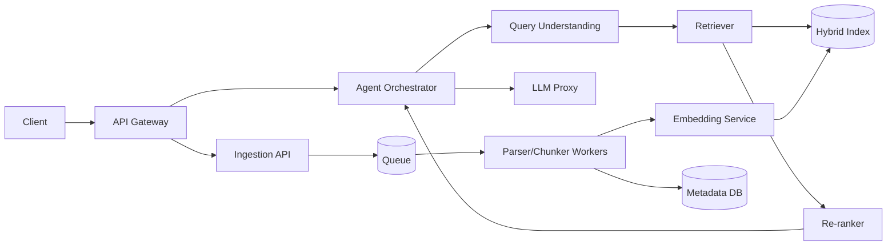

# Assignment 4: Architectural Analysis of RAGFlow

## 1. Deep document understanding vs naive chunking
Deep document understanding outperforms fixed-size chunking because enterprise documents encode meaning in layout, not just token order. A table row split across arbitrary 512-token windows destroys answerability, while layout-aware parsing preserves row/column semantics, section hierarchy, and figure-caption linkage.

- **Retrieval fidelity:** Logical units (table, clause, subsection) map to retrieval units, reducing false negatives from boundary splits and false positives from mixed-topic chunks.
- **Index design:** Rich metadata (element type, page, section path, coordinates) enables filtered and boosted retrieval (e.g., prioritize tables in finance questions). This supports hybrid ranking beyond plain text similarity.
- **Preprocessing cost:** OCR/layout/TSR increases ingestion latency and compute cost, but this is usually an amortized batch expense. In high-value enterprise corpora, better recall/precision at query time is worth slower ingestion.

The general principle: pay structure-extraction cost once to reduce recurring retrieval error on every query.

## 2. Chunking strategy: template vs semantic
**Template-based chunking** uses known document structure (headings, numbering, form fields).  
**Semantic segmentation** uses embedding-space topic shifts.

- **Highly structured docs (financial, legal, policy manuals):** Template chunking usually wins. These documents have stable grammar and section conventions; semantic methods may merge numerically similar but functionally distinct content.
- **Loosely structured corpora (chat logs, support threads):** Semantic segmentation usually wins. Templates fail because structural markers are weak or inconsistent.

Failure modes:
- Template fails when structure is absent, inconsistent, or multilingual with varied formatting.
- Semantic fails when embeddings under-represent tables/codes/IDs and when adjacent sections use similar vocabulary but different intent.

Best architecture is **routing by document type**: structure-aware chunking for rigid formats, semantic chunking for unstructured text, plus guardrails on chunk size and overlap.

## 3. Hybrid retrieval architecture
Let lexical and vector candidate sets be \(R_{lex}\) and \(R_{vec}\). Candidate union gives
\[
R_{hybrid} = R_{lex} \cup R_{vec}
\]
so recall is at least as high as either method alone. Precision is recovered by re-ranking (cross-encoder or learned fusion), which applies stronger query-document interaction than BM25 or bi-encoder cosine.

Failure cases:
- **Lexical-only:** Misses paraphrases and synonym shifts.
- **Vector-only:** Misses exact identifiers (error codes, part numbers, policy IDs).
- **Hybrid edge case:** Ambiguous one-word queries can retrieve two valid senses (e.g., company vs fruit). Fusion raises candidate quality but does not solve intent ambiguity without query disambiguation.

General insight: hybrid improves candidate coverage; re-ranking and query understanding decide final precision.

## 4. Multi-stage retrieval pipeline
A multi-stage pipeline (retrieve -> re-rank -> optional rewrite/retrieve) is better than single-pass ANN because it separates **high-recall candidate generation** from **high-precision scoring**.

- **Recall vs latency:** Wide candidate generation increases recall, while expensive re-ranking is applied to a small set. This dominates single-pass ANN that must choose between low latency and insufficient recall.
- **Cascading error propagation:** If stage 1 misses the relevant document, downstream stages cannot recover it. Therefore stage-1 design must maximize recall diversity (BM25 + dense + filters).

Mitigations:
1. Oversample candidates before re-ranking.
2. Calibrate confidence thresholds for retry/rewrites.
3. Add query decomposition when question entropy is high.

This pattern generalizes to ranking systems: early-stage recall is the hard ceiling; later stages optimize precision within that ceiling.

## 5. Indexing strategy and storage backends
Backend choice should be based on query mix, scale, latency SLO, and operational maturity.

| Backend | Strengths | Weaknesses | Best workload |
| --- | --- | --- | --- |
| **Elasticsearch-like hybrid store** | BM25 + vector + filters in one system; mature ops | Heavier memory footprint; vector performance may lag specialized engines at very high scale | Enterprise search with mixed lexical/semantic queries and rich metadata filters |
| **Vector-native DB** | Fast ANN, compression/quantization, large vector scale | Weaker lexical/phrase semantics in many setups | Semantic-heavy apps with massive embedding corpora and strict latency targets |
| **Graph-augmented store** | Multi-hop relation queries, explicit reasoning paths | Costly graph construction/maintenance | Domains requiring relationship reasoning and explainability (biomed, compliance, supply chain) |

Many production systems are polyglot: hybrid text/vector primary path plus graph for relationship-intensive queries.

## 6. Query understanding and reformulation
Static retrieval assumes user wording matches corpus wording. In practice, vocabulary mismatch, hidden constraints, and multi-intent questions make this false.

- **Static query -> retrieval:** Fast and cheap, but brittle under synonym drift, ambiguous terms, and multi-hop needs.
- **Iterative refinement (agent-driven):** Rewrite/expand/decompose queries based on retrieval confidence and conversation context; improves robustness but increases latency, token cost, and risk of rewrite drift.

High-quality systems add policy controls:
1. Trigger refinement only below confidence thresholds.
2. Keep rewrite traces for observability/audit.
3. Bound iterations to control latency.

Core trade-off: deterministic speed vs adaptive accuracy.

## 7. Knowledge representation layer
No single representation dominates; each optimizes different reasoning tasks.

| Representation | Compositional reasoning | Explainability | Typical role |
| --- | --- | --- | --- |
| **Dense vectors** | Weak for explicit logic/multi-hop | Low (latent similarity) | Broad semantic recall |
| **Relational schema** | Strong for joins, filters, aggregates | High (explicit predicates/joins) | Structured facts, governance, constraints |
| **Knowledge graph** | Strongest for typed multi-hop relations | High (path-based evidence) | Entity-centric reasoning and provenance |

A robust design uses layered retrieval: vectors for recall, SQL for exact constraints, graph traversal for relationship reasoning. Query planner/orchestrator should route by intent.

## 8. Data ingestion pipeline architecture
A robust ingestion system should normalize heterogeneous sources into a canonical intermediate representation (IR), then run asynchronous processing stages.

- **Schema normalization:** Parse PDFs, docs, tables, and web sources into common blocks (content, metadata, provenance, confidence).
- **Incremental indexing:** Use content hashing/versioning to detect add/update/delete and propagate changes to all derived artifacts (chunks, embeddings, graph nodes).
- **Consistency vs throughput:** Asynchronous pipelines (queue + workers) maximize throughput and fault tolerance; eventual consistency is usually acceptable for knowledge bases.

Recommended controls:
1. Idempotent jobs and retry policies.
2. Dead-letter queue for parser failures.
3. Per-source SLAs and backpressure.
4. Data lineage from source -> chunk -> index entry.

This architecture minimizes reprocessing cost while preserving correctness under continuous updates.

## 9. Memory design in RAG systems
Memory should combine complementary stores:

- **Vector memory (semantic recall):** Good for fuzzy retrieval of prior context; weak on strict temporal/state queries.
- **Structured memory (SQL/graph):** Best for durable user/profile/task state and exact constraints; requires extraction quality and schema evolution.
- **Episodic logs (temporal trace):** Lossless chronological record; ideal for audit/debug, but too noisy for direct long-context prompting.

Practical design is hierarchical:
1. Episodic log as source of truth.
2. Structured facts extracted from logs.
3. Vector index over summaries/snippets for semantic recall.

This yields better controllability than a vector-only memory and better flexibility than schema-only memory.

## 10. End-to-end system decomposition
RAGFlow-like systems are best decomposed into service domains with clear state boundaries.

Design choices:
- **Stateless services:** API, retrieval, re-ranker, embedding, query understanding. Scale horizontally with load.
- **Stateful components:** Index store, metadata DB, queue, and session memory backing orchestrator state.
- **Scaling strategy:** Scale ingestion workers by queue depth, retrieval by QPS and index shard/replica health, orchestrator by active sessions.
- **Failure isolation:** Separate ingestion from serving path; isolate LLM provider failures behind proxy/circuit breakers; degrade gracefully when retrieval backend is impaired.

General lesson: isolate stateful bottlenecks, keep compute services stateless, and enforce bulkheads between ingestion and online serving.

## References
- RAGFlow repository: https://github.com/infiniflow/ragflow
- DeepDoc overview: https://github.com/infiniflow/ragflow/blob/main/deepdoc/README.md
- RAGFlow docs: https://ragflow.io/docs
- RAGFlow GraphRAG blog: https://ragflow.io/blog/ragflow-support-graphrag
- RAGFlow Infinity backend blog: https://ragflow.io/blog/500-percent-faster-vector-retrieval-90-percent-memory-savings-three-groundbreaking-technologies-in-infinity-v0.6.0-that-revolutionize-hnsw
- Lewis et al. (RAG), 2020: https://arxiv.org/abs/2005.11401
